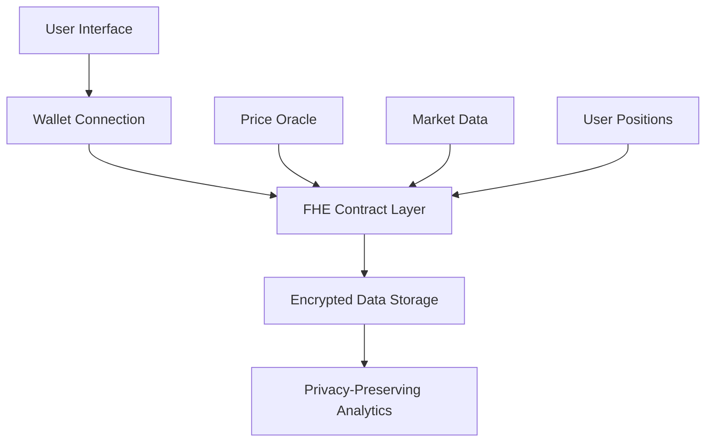

# 🚀 FHEtastic Synthetics Market

> **The Future of Private Trading is Here**  
> Experience next-generation synthetic asset trading with fully homomorphic encryption technology.

[](https://opensource.org/licenses/MIT)
[](https://www.typescriptlang.org/)
[](https://reactjs.org/)
[](https://vitejs.dev/)

## 🌟 What Makes Us Different?

### 🔐 **Privacy-First Architecture**
Unlike traditional trading platforms, FHEtastic uses **Fully Homomorphic Encryption (FHE)** to ensure your trading data remains private even during computation. Your positions, volumes, and strategies stay confidential.

### ⚡ **Lightning-Fast Synthetic Assets**
Trade synthetic versions of real-world assets with zero slippage and instant settlement. From stocks to commodities, crypto to forex - all in one encrypted marketplace.

### 🎯 **Advanced Market Analytics**
Get real-time insights with encrypted data processing. Analyze market trends without exposing your trading patterns or positions.

## 🛠️ Tech Stack

| Category | Technology | Purpose |
|----------|------------|---------|
| **Frontend** | React 18 + TypeScript | Modern UI framework |
| **Styling** | Tailwind CSS + shadcn/ui | Beautiful, responsive design |
| **Web3** | Wagmi + Viem + RainbowKit | Wallet connectivity |
| **Encryption** | FHE (Fully Homomorphic) | Privacy-preserving computation |
| **State** | TanStack Query | Efficient data management |
| **Build** | Vite | Fast development & builds |

## 🚀 Quick Start

### Prerequisites
- **Node.js** 18+ (recommended: use [nvm](https://github.com/nvm-sh/nvm))
- **npm** or **yarn** package manager
- **Git** for version control

### Installation

```bash
# Clone the repository
git clone https://github.com/EleanorPriceLee/fhetastic-synthetics-market.git
cd fhetastic-synthetics-market

# Install dependencies
npm install

# Copy environment template
cp env.example .env.local

# Start development server
npm run dev
```

### 🔧 Environment Setup

Create a `.env.local` file with your configuration:

```env
# Network Configuration
NEXT_PUBLIC_CHAIN_ID=11155111
NEXT_PUBLIC_RPC_URL=your_rpc_endpoint_here

# Wallet Configuration  
NEXT_PUBLIC_WALLET_CONNECT_PROJECT_ID=your_project_id_here

# Optional: Infura Configuration
NEXT_PUBLIC_INFURA_API_KEY=your_infura_key_here
```

## 📱 Available Scripts

| Command | Description |
|---------|-------------|
| `npm run dev` | Start development server |
| `npm run build` | Build for production |
| `npm run preview` | Preview production build |
| `npm run lint` | Run ESLint checks |

## 🏗️ Architecture Overview



## 🔒 Security Features

- **🔐 FHE Encryption**: All sensitive data encrypted at rest and in transit
- **🛡️ Zero-Knowledge Proofs**: Verify transactions without revealing data
- **🔑 Multi-Sig Wallets**: Enhanced security for large positions
- **📊 Private Analytics**: Market insights without data exposure

## 🌐 Deployment Options

### Vercel (Recommended)
1. Connect your GitHub repository to Vercel
2. Configure environment variables
3. Deploy with one click

### Self-Hosted
```bash
npm run build
# Deploy the 'dist' folder to your hosting provider
```

## 🤝 Contributing

We welcome contributions! Here's how to get started:

1. **Fork** the repository
2. **Create** a feature branch (`git checkout -b feature/amazing-feature`)
3. **Commit** your changes (`git commit -m 'Add amazing feature'`)
4. **Push** to the branch (`git push origin feature/amazing-feature`)
5. **Open** a Pull Request

### Development Guidelines
- Follow TypeScript best practices
- Write comprehensive tests
- Update documentation for new features
- Follow conventional commit messages

## 📄 License

This project is licensed under the MIT License - see the [LICENSE](LICENSE) file for details.

## 🆘 Support & Community

- **🐛 Bug Reports**: [GitHub Issues](https://github.com/EleanorPriceLee/fhetastic-synthetics-market/issues)
- **💡 Feature Requests**: [GitHub Discussions](https://github.com/EleanorPriceLee/fhetastic-synthetics-market/discussions)
- **📖 Documentation**: [Wiki](https://github.com/EleanorPriceLee/fhetastic-synthetics-market/wiki)

## 🎯 Roadmap

- [ ] **Q1 2024**: Mobile app release
- [ ] **Q2 2024**: Advanced FHE algorithms
- [ ] **Q3 2024**: Cross-chain support
- [ ] **Q4 2024**: Institutional features

---

<div align="center">

**Built with ❤️ by the FHEtastic Team**

[Website](https://fhetastic-synthetics.vercel.app) • [Documentation](https://docs.fhetastic-synthetics.com) • [Discord](https://discord.gg/fhetastic)

</div>